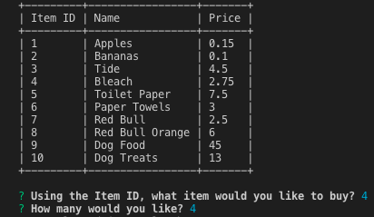
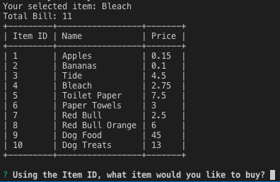

# Bamazon!

## What is Bamazon?

Bamazon is a command-line based application that simulates the checkout at a supermarket. It allows a user to select an item and its quantity - validating the order can be fulfilled before displaying the appropriate message.

## How was it implemented?

Bamazon is based on Node.js and uses a MySQL database for its underlying storage. It uses the Inquirer package to solicit and process user input from the command line.

## Dependencies

Bamazon uses the following node packages as dependencies:

* [mysql](https://www.npmjs.com/package/mysql) - Used to connect to and query the underlying database
* [inquirer](https://www.npmjs.com/package/inquirer) - Used to solicit and process user input
* [prettytable](https://www.npmjs.com/package/prettytable) - Used to display tables in a more user-friendly and visually appealing manner in the terminal

## Database details

All the necessary queries to create the table and populate the initial list of products and associated quantities are available in the 'bamazon.sql' file. They are as follows:

```
USE bamazon;

CREATE TABLE Products(
	item_id int NOT NULL AUTO_INCREMENT PRIMARY KEY,
    product_name varchar(30),
    department_name varchar(30),
    price float,
    stock_quantity int
);

INSERT INTO Products(product_name, department_name, price, stock_quantity)
VALUES
	('Apples', 'Produce', .15, 25),
    ('Bananas', 'Produce', .10, 30),
	('Tide', 'Cleaning', 4.50, 15),
    ('Bleach', 'Cleaning', 2.75, 20),
	('Toilet Paper', 'Paper Products', 7.50, 3),
    ('Paper Towels', 'Paper Products', 3, 7),
	('Red Bull', 'Beverages', 2.50, 10),
    ('Red Bull Orange', 'Beverages', 6, 15),
	('Dog Food', 'Pets', 45, 10),
    ('Dog Treats', 'Pets', 13, 8)

``` 
## Looking at the code:
* **bamazon.js:** All the main functionality of the app. The entry point for the application.
* **.gitignore:** File which instructs git to ignore the files contained in it

 
## Unpacking liri.js:
The application is divided into three main parts
* Section 1: Requiring our dependencies and setting them up for later use.

* Section 2: Configuring and initiating the database connection

* Section 3: This section first displays the list of products available and prompts the user for the Item ID and quantity they're looking to purchase. It then validates if the purchase is possible and displays and appropriate message before showing the updated list of products again.
 
## Start to Finish:
Here's how you can use Bamazon!

1. Enter Item ID and Quantity

2. See final purchase



Designed and developed by: Maci Slenes
